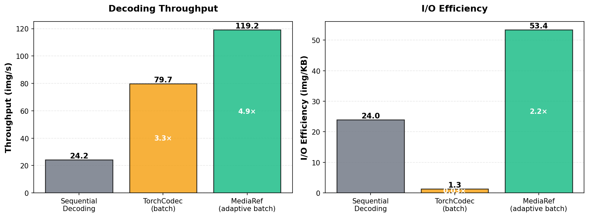

# MediaRef

[](https://github.com/open-world-agents/MediaRef/actions?query=event%3Apush+branch%3Amain+workflow%3ACI)
[](https://pypi.python.org/pypi/mediaref)
[](https://github.com/open-world-agents/MediaRef)
[](https://github.com/open-world-agents/MediaRef/blob/main/LICENSE)

<!-- [](https://pepy.tech/project/mediaref) -->

Pydantic media reference for images and video frames (with timestamp support) from data URIs, HTTP URLs, file URIs, and local paths. Features lazy loading and optimized batch video decoding.

## Installation

```bash
# Core package with image loading support
pip install mediaref

# With video support (adds PyAV for video frame extraction)
pip install mediaref[video]
```

## Quick Start

### Basic Usage

```python
from mediaref import MediaRef, DataURI, batch_decode
import numpy as np

# 1. Create references (lightweight, no loading yet)
ref = MediaRef(uri="image.png")                        # Local file
ref = MediaRef(uri="https://example.com/image.jpg")    # Remote URL
ref = MediaRef(uri="video.mp4", pts_ns=1_000_000_000)  # Video frame at 1.0s

# 2. Load media
rgb = ref.to_rgb_array()                               # Returns (H, W, 3) numpy array
pil = ref.to_pil_image()                               # Returns PIL.Image

# 3. Embed as data URI
data_uri = DataURI.from_image(rgb, format="png")       # e.g., "data:image/png;base64,iVBORw0KG..."
ref = MediaRef(uri=data_uri)                           # Self-contained reference

# 4. Batch decode video frames (opens video once, reuses handle)
refs = [MediaRef(uri="video.mp4", pts_ns=int(i*1e9)) for i in range(10)]
frames = batch_decode(refs)                            # Much faster than loading individually
```

### Batch Decoding - Optimized Video Frame Loading

When loading multiple frames from the same video, `batch_decode()` opens the video file once and reuses the handle, achieving **4.9× faster throughput** and **41× better I/O efficiency** compared to existing methods.

<p align="center">
  
</p>

> **Benchmark details**: Measured on real ML dataloader workloads (Minecraft dataset: 64×5 min episodes, 640×360 @ 20Hz, FSLDataset with 4096 token sequences) vs baseline and TorchCodec v0.6.0. See [D2E paper](https://worv-ai.github.io/d2e/) Section 3 and Appendix A for full methodology.

```python
from mediaref import MediaRef, batch_decode
from mediaref.video_decoder import BatchDecodingStrategy

# Use optimized batch decoding with adaptive strategy (default, recommended)
refs = [MediaRef(uri="video.mp4", pts_ns=int(i*1e9)) for i in range(10)]
frames = batch_decode(
    refs,
    # Our optimized implementation based on PyAV
    decoder="pyav",
    # Our adaptive strategy for optimal performance
    strategy=BatchDecodingStrategy.SEQUENTIAL_PER_KEYFRAME_BLOCK
)

# Or use TorchCodec for GPU-accelerated decoding
frames = batch_decode(refs, decoder="torchcodec")  # Requires: pip install torchcodec>=0.4.0
```

### Embedding Media Directly in MediaRef

You can embed image data directly into `MediaRef` objects, making them self-contained and portable (useful for serialization, caching, or sharing).

```python
from mediaref import MediaRef, DataURI
import numpy as np

# Create embedded MediaRef from numpy array
rgb = np.random.randint(0, 255, (100, 100, 3), dtype=np.uint8)
embedded_ref = MediaRef(uri=DataURI.from_image(rgb, format="png"))

# Or from file
embedded_ref = MediaRef(uri=DataURI.from_file("image.png"))

# Or from PIL Image
from PIL import Image
pil_img = Image.open("image.png")
embedded_ref = MediaRef(uri=DataURI.from_image(pil_img, format="jpeg", quality=90))

# Use just like any other MediaRef
rgb = embedded_ref.to_rgb_array()                      # (H, W, 3) numpy array
pil = embedded_ref.to_pil_image()                      # PIL Image

# Serialize with embedded data
serialized = embedded_ref.model_dump_json()            # Contains image data
restored = MediaRef.model_validate_json(serialized)    # No external file needed!

# Properties
print(data_uri.mimetype)                               # "image/png"
print(len(data_uri))                                   # URI length in bytes
print(data_uri.is_image)                               # True for image/* types
```

### Path Resolution & Serialization

Resolve relative paths and serialize MediaRef objects for dataset metadata and storage.

```python
# Resolve relative paths (useful for MCAP/rosbag datasets)
ref = MediaRef(uri="relative/video.mkv", pts_ns=123456)
resolved = ref.resolve_relative_path("/data/recording.mcap")

# Serialization (Pydantic-based)
data = ref.model_dump()                                # {'uri': '...', 'pts_ns': ...}
json_str = ref.model_dump_json()                       # JSON string
ref = MediaRef.model_validate(data)                    # From dict
ref = MediaRef.model_validate_json(json_str)           # From JSON
```

## API Reference

### MediaRef(uri: str | DataURI, pts_ns: int | None = None)

**Properties:** `is_embedded`, `is_video`, `is_remote`, `is_local`, `is_relative_path`

**Methods:**
- `to_rgb_array(**kwargs) -> np.ndarray` - Load as RGB array (H, W, 3)
- `to_pil_image(**kwargs) -> PIL.Image` - Load as PIL Image
- `resolve_relative_path(base_path, allow_nonlocal=False) -> MediaRef` - Resolve relative paths
- `validate_uri() -> bool` - Check if URI exists (local files only)
- `model_dump() -> dict` - Serialize to dict
- `model_dump_json() -> str` - Serialize to JSON
- `model_validate(data) -> MediaRef` - Deserialize from dict
- `model_validate_json(json_str) -> MediaRef` - Deserialize from JSON

### DataURI (for embedding media)

**Class Methods:**
- `from_image(image: np.ndarray | PIL.Image, format="png", quality=None) -> DataURI` - Create from image
- `from_file(path: str | Path, format=None) -> DataURI` - Create from file
- `from_uri(uri: str) -> DataURI` - Parse data URI string

**Methods:**
- `to_rgb_array() -> np.ndarray` - Convert to RGB array (H, W, 3)
- `to_pil_image() -> PIL.Image` - Convert to PIL Image

**Properties:**
- `uri: str` - Full data URI string
- `is_image: bool` - True if MIME type is image/*

### Functions

- `batch_decode(refs, strategy=None, decoder="pyav", **kwargs) -> list[np.ndarray]` - Batch decode using optimized batch decoding API
  - `refs`: List of MediaRef objects to decode
  - `strategy`: Batch decoding strategy (PyAV only): `SEPARATE`, `SEQUENTIAL`, or `SEQUENTIAL_PER_KEYFRAME_BLOCK` (default)
  - `decoder`: Decoder backend (`"pyav"` or `"torchcodec"`)
- `cleanup_cache()` - Clear video container cache (PyAV only)

### Video Decoders (requires `[video]` extra)

- `PyAVVideoDecoder(source)` - PyAV-based decoder with batch decoding strategies
  - Supports batch decoding strategies: `SEPARATE`, `SEQUENTIAL`, `SEQUENTIAL_PER_KEYFRAME_BLOCK`
  - CPU-based decoding using FFmpeg
  - Automatic container caching with reference counting
- `TorchCodecVideoDecoder(source)` - TorchCodec-based decoder for GPU acceleration
  - Requires `torchcodec>=0.4.0` (install separately)
  - GPU-accelerated decoding with CUDA support
  - Does not support batch decoding strategies (parameter ignored)

**Decoder Comparison:**

| Feature | PyAVVideoDecoder | TorchCodecVideoDecoder |
|---------|------------------|------------------------|
| Batch decoding strategies | ✅ Full support | ❌ Not supported (ignored) |
| GPU acceleration | ❌ CPU only | ✅ CUDA support |
| Backend | PyAV (FFmpeg) | TorchCodec (FFmpeg) |
| Installation | `pip install mediaref[video]` | `pip install torchcodec>=0.4.0` |

**When to use:**
- Use `PyAVVideoDecoder` (default) for fine-grained control over batch decoding strategies
- Use `TorchCodecVideoDecoder` for GPU-accelerated decoding when processing large batches

## Design Notes

- **Video container caching**: Uses reference counting with LRU eviction (default: 10 containers)
- **MCAP file path resolution**: Detects `.mcap` suffix and uses parent directory as base path
- **Garbage collection**: Triggered every 10 PyAV operations to handle FFmpeg reference cycles
- **Cache size**: Configurable via `AV_CACHE_SIZE` environment variable
- **Lazy loading**: Video dependencies only imported when needed (not at module import time)

## Acknowledgments

The video decoder interface design references [TorchCodec](https://github.com/pytorch/torchcodec)'s API design.

## Dependencies

**Core dependencies** (automatically installed):
- `pydantic>=2.0` - Data validation and serialization (requires Pydantic v2 API)
- `numpy` - Array operations
- `opencv-python` - Image loading and color conversion
- `pillow>=9.4.0` - Image loading from various sources
- `requests>=2.32.2` - HTTP/HTTPS URL loading
- `loguru` - Logging (disabled by default for library code)

**Optional dependencies**:
- `[video]` extra: `av>=15.0` (PyAV for video frame extraction)
- TorchCodec: `torchcodec>=0.4.0` (install separately for GPU-accelerated decoding)

