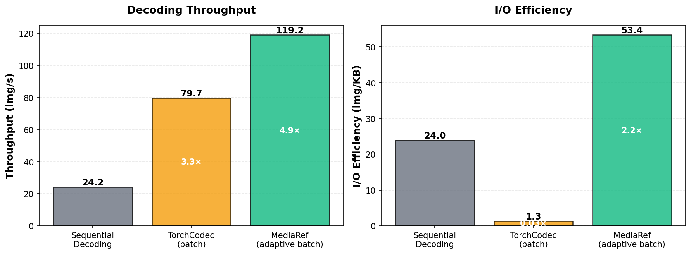

# MediaRef

[](https://github.com/open-world-agents/MediaRef/actions?query=event%3Apush+branch%3Amain+workflow%3ACI)
[](https://pypi.python.org/pypi/mediaref)
[](https://github.com/open-world-agents/MediaRef)
[](https://github.com/open-world-agents/MediaRef/blob/main/LICENSE)

<!-- [](https://pepy.tech/project/mediaref) -->

**The portable frame-level media reference primitive — container-agnostic, fps-free, RFC-based.**

`(uri, pts_ns)` is the entire schema. URIs follow [RFC 3986](https://datatracker.ietf.org/doc/html/rfc3986) (with [RFC 2397](https://datatracker.ietf.org/doc/html/rfc2397) for embedded data); `pts_ns` is an int64 nanosecond presentation timestamp. The schema is frozen for the life of [MediaRef Spec 1.x](docs/SPEC.md). Works in any container (Parquet, mcap, rosbag, HDF5) and any standard media format (JPEG, PNG, H.264, H.265, AV1).

## Quick Start

```python
from mediaref import MediaRef, DataURI, batch_decode
import numpy as np

# 1. Create references — local file, HTTP(S), cloud, or video frame.
ref = MediaRef(uri="image.png")
ref = MediaRef(uri="https://example.com/image.jpg")
ref = MediaRef(uri="s3://bucket/image.jpg")             # any fsspec scheme
ref = MediaRef(uri="video.mp4", pts_ns=1_000_000_000)   # frame at 1.0s

# 2. Load.
rgb = ref.to_ndarray()      # (H, W, 3) RGB
pil = ref.to_pil_image()

# 3. Embed bytes inside a MediaRef (self-contained reference).
ref = MediaRef(uri=DataURI.from_image(rgb, format="png"))

# 4. Batch-decode many frames from one video — opens the container once.
refs = [MediaRef(uri="video.mp4", pts_ns=int(i*1e9)) for i in range(10)]
frames = batch_decode(refs)

# 5. Serialize for storage in any string-based format.
json_str = ref.model_dump_json()   # '{"uri":"...","pts_ns":...}'
```

See [API Reference](docs/API.md) for full details — `DataURI`, `batch_decode`, cloud URIs, HuggingFace `datasets` integration, lerobot interop, the `mediaref` CLI.

## Why MediaRef?

**1. Separate heavy media from lightweight metadata.** Store 1 TB of videos separately and keep only a few KB of references in your tables. MediaRef is decoupled, format-agnostic, and works wherever you can store a string. Already used in production: the [D2E research project](https://worv-ai.github.io/d2e/) stores **10 TB+** of gameplay data referenced by MediaRef via [OWAMcap](https://open-world-agents.github.io/open-world-agents/data/technical-reference/format-guide/).

**2. Permanent schema built on RFCs.** `(uri, pts_ns)` is frozen for the life of [Spec 1.x](docs/SPEC.md). No proprietary formats, no breaking changes.

**3. Sparse-frame batch decoding.** When loading many frames from a single video, `batch_decode()` opens the container once and seeks monotonically — **4.9× faster decoding throughput** and **2.2× better I/O efficiency** vs per-frame decoding on a sparse-frame ML dataloader workload. Methodology: [D2E paper](https://worv-ai.github.io/d2e/) Section 3 / Appendix A.

<p align="center">
  
</p>

## Installation

```bash
pip install mediaref                  # core: image loading + cloud-storage URIs (fsspec)
pip install 'mediaref[video]'         # + PyAV for video frame decoding
pip install 'mediaref[hf]'            # + HuggingFace datasets feature registration
pip install 'mediaref[video,hf]'      # all extras
```

For UV: `uv add 'mediaref[video,hf]~=0.5.0'`. MediaRef follows [semantic versioning](https://semver.org/); patch releases are bug-only, minor releases are backward-compatible. The wire schema (`uri`, `pts_ns`) is frozen for the life of Spec 1.x.

## Documentation

- **[API Reference](docs/API.md)** — full API: `MediaRef`, `DataURI`, `batch_decode`, cloud URIs, HuggingFace integration, lerobot interop, the CLI.
- **[MediaRef Specification 1.0](docs/SPEC.md)** — wire format, URI grammar, `pts_ns` semantics, conformance criteria.
- **[Comparisons](docs/COMPARISONS.md)** — how MediaRef relates to `datasets.Video` and lerobot's `VideoFrame`.
- **[Playback Semantics](docs/playback_semantics.md)** — how frame selection works at specific timestamps.

## Datasets shipped with MediaRef

These are projects from the author's own work that use MediaRef on the storage path. External adopters welcome — open a PR to add yours.

| Dataset | Domain | Scale |
| --- | --- | --- |
| [open-world-agents/D2E-Original](https://huggingface.co/datasets/open-world-agents/D2E-Original) | Game agents (29 PC games) | 273.4 hours, 1.83 TB |
| [open-world-agents/D2E-480p](https://huggingface.co/datasets/open-world-agents/D2E-480p) | Game agents (downsampled) | — |
| [maum-ai/CostNav-Teleop-Dataset](https://huggingface.co/datasets/maum-ai/CostNav-Teleop-Dataset) | Delivery-robot navigation / teleop | — |

Tagging a HuggingFace dataset with `mediaref` makes it discoverable at [huggingface.co/datasets?other=mediaref](https://huggingface.co/datasets?other=mediaref).

## Citation

If you reference MediaRef in writing, the [`CITATION.cff`](CITATION.cff) file at repo root has the canonical metadata. BibTeX:

```bibtex
@software{mediaref,
  author = {Choi, Suhwan},
  title  = {MediaRef: a portable frame-level media reference primitive},
  url    = {https://github.com/open-world-agents/MediaRef},
  year   = {2025}
}
```

<!--
## Roadmap

- [ ] **msgspec backend** — replace the Pydantic v2 model with [msgspec](https://jcristharif.com/msgspec/) for faster (de)serialization while keeping the wire format identical.
- [ ] **Audio support** — extend MediaRef to audio references (timestamp-based extraction).
- [ ] **Additional video decoders** — OpenCV, decord, etc., behind the same `batch_decode(decoder=...)` interface.
-->

## Acknowledgments

The video decoder interface design references [TorchCodec](https://github.com/pytorch/torchcodec)'s API design.

## License

MediaRef is released under the [MIT License](LICENSE).
